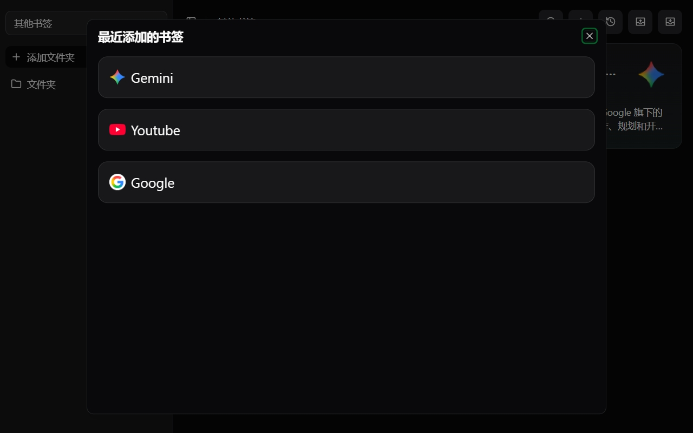

<h1 align="center">Awesome Bookmark</h1>

  
  
一个基于 React 和 Shadcn UI 的 Chrome 书签管理扩展。

## 项目简介

**Awesome Bookmark** 是一款现代化的 Chrome 浏览器书签管理扩展，旨在帮助你更高效地管理和组织浏览器书签。它拥有简洁美观的界面，支持书签的添加、编辑、删除、导入、导出等常用操作，并且支持多种格式（如 HTML、JSON、Markdown）导出书签数据。

主要特性：

- 🌟 支持书签的分组、层级管理
- 🔍 快速搜索书签
- 📝 书签的添加、编辑、删除
- 📥 支持 HTML/JSON/Markdown 格式导入导出
- 🕹️ 最近添加书签快捷入口
- 🖼️ 自动获取网站 favicon 和元信息
- 💄 基于 React + Shadcn UI，界面美观，交互流畅

## 安装方式

### 通过 Chrome 应用商店

### 本地安装

1. 克隆本仓库到本地
2. 执行 `pnpm install` 安装依赖
3. 执行 `pnpm build` 构建项目
4. 打开 Chrome 扩展管理页面，选择“加载已解压的扩展程序”，选择 `dist` 目录

## 截图

---

欢迎 star 和反馈建议！
